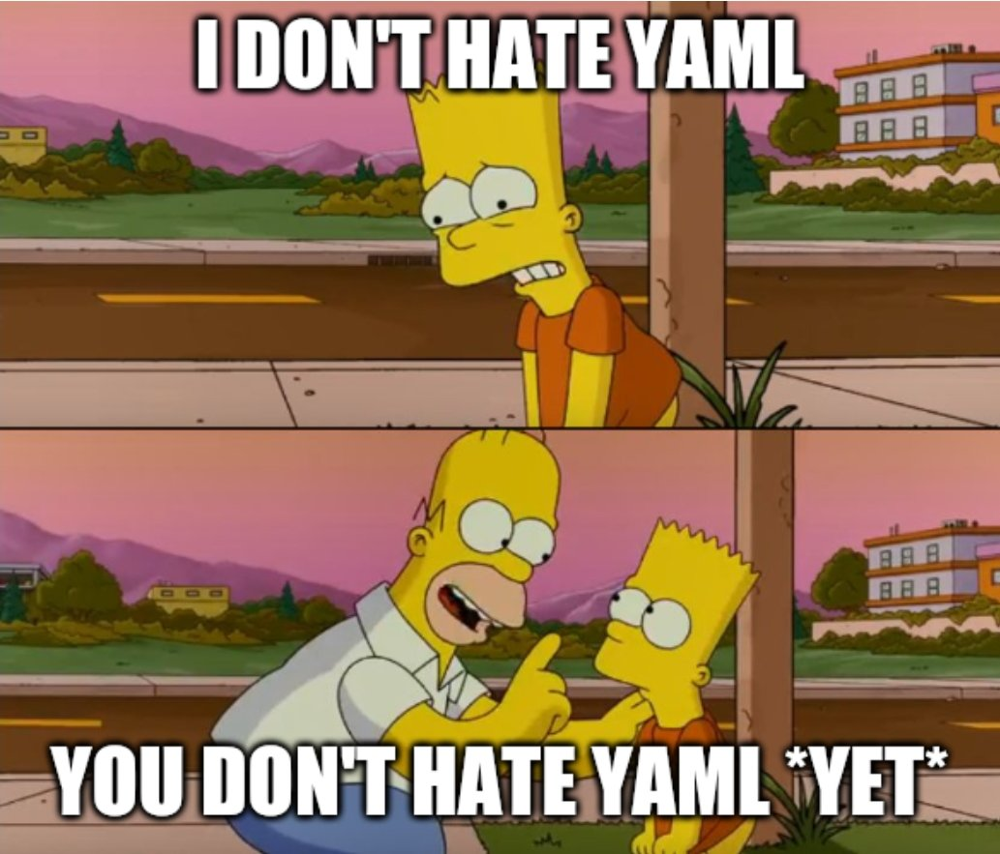

# CDK8s for Java Developers

Examples of how to use Java to define Kubernetes applications

## Prerrequisites

- AWS account 
- [AWS CLI](https://docs.aws.amazon.com/cli/latest/userguide/getting-started-install.html), 
- [cdk8s CLI ](https://cdk8s.io/docs/latest/getting-started/#install-the-cli) 
- [kubectl.](https://kubernetes.io/docs/tasks/tools/#kubectl) 
- [AWS CDK](https://docs.aws.amazon.com/cdk/v2/guide/getting_started.html#getting_started_install)
- [the Java programming language (v1.8 or above)](https://sdkman.io/jdks) 
- [Docker](https://docs.docker.com/engine/install/)

## Introduction

We will cover how Java developers can use the [cdk8s](https://cdk8s.io/docs/latest/) (Cloud Development Kit for Kubernetes)
project for defining Kubernetes resources. It's an open-source framework (also part of CNCF) that provides high-level abstractions which can be
composed into larger Kubernetes applications. Instead of adopting YAML or other configuration/template driven approach, `cdk8s` supports multiple
programming languages, which means you can work with Kubernetes resources using familiar concepts such as classes, methods, etc.
Ultimately, `cdk8s` generates Kubernetes manifests which you can apply using kubectl - business as usual!

Across the examples in this repository we will provide a hands-on intro to [cdk8s](https://cdk8s.io/docs/latest/).
We will also show how [cdk8s-plus](https://cdk8s.io/docs/latest/plus/) leverages building blocks from cdk8s core library, thereby helping reduce verbosity 
and complexity by providing higher level abstractions/APIs for all Kubernetes objects such as Deployments, Services, etc.
We will demonstrate how you can use [Kubernetes Custom Resource Definitions](https://kubernetes.io/docs/concepts/extend-kubernetes/api-extension/custom-resources/#customresourcedefinitions) with cdk8s
Also we will cover how to create custom **Constructs** to define your own reusable components.
By the end of it, we will show with examples how to use [AWS Controllers for Kubernetes](https://aws-controllers-k8s.github.io/community/docs/community/overview/) to deploy AWS
infraestructure using K8s and also how to combine cdk8s with AWS CDK, so you can have the best of both worlds!

No more YAML!

